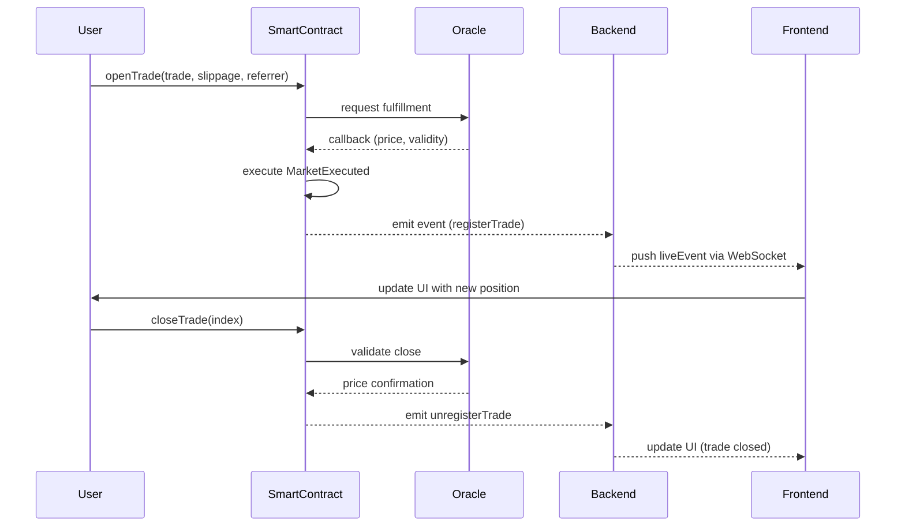

# Gtrade-NeoStocksAi

# ⚡️ GNS Multi-Collateral Trading System (Arbitrum)

**Network:** Arbitrum

**Contract Address:** `0xff162c694eaa571f685030649814282ea457f169`

**Backend Base URL:** [https://backend-arbitrum.gains.trade](https://backend-arbitrum.gains.trade/)

**USDC Address:** `0xaf88d065e77c8cc2239327c5edb3a432268e5831`
ABI: https://541513631-files.gitbook.io/~/files/v0/b/gitbook-x-prod.appspot.com/o/spaces%2F-MXazyLIr0z2c0oFESmS%2Fuploads%2F6pGR7XHbo0m9lSnNcrrF%2FGNSMultiCollatDiamond.json?alt=media&token=0a10fd0e-b924-45a6-a457-933142bb3fbf

This documentation explains how to interact with the **GNS Multi-Collateral Diamond** contract and its backend endpoints to place, update, and manage trades.

---

## 🧭 Overview

The **GNS Multi-Collateral Diamond** allows decentralized margin trading using multiple collateral types on Arbitrum.

It supports:

- Market and limit orders
- Oracle-based fulfillment
- Multi-collateral handling
- Fully on-chain trade lifecycle
- Real-time backend + WebSocket sync

---

## ⚙️ Interactions

Below is a list of available trading actions:

| Action | Description |
| --- | --- |
| **Place a Trade** | Opens a market order (`tradeType = 0`). |
| **Place a Limit Order** | Opens a limit or stop order (`tradeType = 1` or `2`). |
| **Update a Trade** | Modify TP/SL of an open position. |
| **Update Limit Order** | Adjust price, TP/SL, or leverage for pending orders. |
| **Cancel Limit Order** | Cancel an unfilled limit order. |
| **Close Trade** | Market close an open trade. |
| **Update Leverage** | Increase or decrease trade leverage. |
| **Modify Position Size** | Increase or decrease exposure by changing collateral or leverage. |

> ⚠️ Note: Market and close trades require oracle fulfillment.
> 
> 
> If unfilled after 60 seconds, collateral can be reclaimed via timeout.
> 

---

## 🧩 Contract Functions

### 🟢 Place Trade

```solidity
function openTrade(
  ITradingStorage.Trade calldata _trade,
  uint16 _maxSlippageP,
  address _referrer
) external;

function openTradeNative(
  ITradingStorage.Trade calldata _trade,
  uint16 _maxSlippageP,
  address _referrer
) external payable;

```

**Trade Struct**

```solidity
{
  address user;
  uint32 index;
  uint16 pairIndex;
  uint24 leverage;
  bool long;
  bool isOpen;
  uint8 collateralIndex;
  uint8 tradeType; // 0 = MARKET, 1 = LIMIT, 2 = STOP
  uint120 collateralAmount;
  uint64 openPrice;
  uint64 tp;
  uint64 sl;
}

```

**ethers.js Example**

```jsx
const CONTRACT_ADDRESS = "0xff162c694eaa571f685030649814282ea457f169";
const gns = new ethers.Contract(CONTRACT_ADDRESS, abi, signer);

const trade = {
  user: signer.address,
  index: 0,
  pairIndex: 19,
  leverage: 150000,
  long: true,
  isOpen: true,
  collateralIndex: 1,
  tradeType: 0, // market order
  collateralAmount: ethers.utils.parseUnits("550", 18),
  openPrice: 7700000000,
  tp: 8162000000,
  sl: 0
};

await gns.openTrade(trade, 1000, ethers.constants.AddressZero);

```

---

### 🟡 Place Limit Order

Same as `openTrade`, but with `tradeType = 1` (limit) or `tradeType = 2` (stop).

- **Limit:** Go long below or short above current price.
- **Stop:** Go long above or short below current price (breakout logic).

⏱ If not filled within 60s, collateral can be reclaimed via timeout.

---

### ✏️ Update Active Trade

```solidity
function updateTpSl(
  uint32 _index,
  uint64 _newTp,
  uint64 _newSl
) external;

```

**Example**

```jsx
await gns.updateTpSl(0, 8162000000, 7500000000);

```

Emits `TradeTpUpdated` and/or `TradeSlUpdated`.

---

### 🟠 Cancel Pending Limit Order

```solidity
function cancelOpenOrder(uint32 _index) external;

```

**Example**

```jsx
await gns.cancelOpenOrder(0);

```

Cancels any unfulfilled limit order.

---

### 💥 Close Trade

```solidity
function closeTrade(uint32 _index) external;
function closeTradeMarket(uint32 _index, uint64 _expectedPrice) external;

```

**Example**

```jsx
await gns.closeTradeMarket(0, 7700000000);

```

Unfulfilled trades may trigger a timeout to reclaim collateral.

---

### ⚖️ Update Leverage

```solidity
function updateLeverage(uint32 _index, uint24 _newLeverage) external;
function updateLeverageNative(uint32 _index, uint24 _newLeverage) external payable;

```

**Example**

```jsx
await gns.updateLeverage(0, 200000);

```

Emits `LeverageUpdateInitiated → LeverageUpdateExecuted`.

---

### 📈 Modify Position Size

Position size can be modified by adjusting leverage or collateral.

Events emitted:

- `PositionSizeUpdateInitiated`
- `PositionSizeIncreaseExecuted`
- `PositionSizeDecreaseExecuted`

---

## 🔁 Event Lifecycle

| Action | Event Sequence |
| --- | --- |
| Market trade open/close | `MarketOrderInitiated → MarketExecuted` |
| Limit order placed | `OpenOrderPlaced` |
| Trade updated | `TradeSlUpdated` / `TradeTpUpdated` |
| Limit fulfilled | `LimitExecuted` |
| Leverage updated | `LeverageUpdateInitiated → LeverageUpdateExecuted` |
| Position updated | `PositionSizeUpdateInitiated → PositionSizeIncreaseExecuted / DecreaseExecuted` |

---

## 🛰️ Backend API

### `/trading-variables`

Fetches all pairs, groups, fees, and system settings.

```json
{
  "lastRefreshed": "2024-05-20T21:07:02.133Z",
  "tradingState": 0,
  "globalTradeFeeParams": {
    "referralFeeP": "5000",
    "govFeeP": "24500",
    "triggerOrderFeeP": "4000",
    "gnsOtcFeeP": "56500",
    "gTokenFeeP": "15000"
  },
  "pairs": [{ "from": "ETH", "to": "USD", "spreadP": "400000000" }]
}

```

---

### `/open-trades` & `/open-trades/<address>`

Returns active trades or user-specific open trades.

```jsx
const res = await fetch("https://backend-arbitrum.gains.trade/open-trades/0xUserAddress");
const data = await res.json();
console.log(data);

```

---

### `/user-trading-variables/<address>`

Returns user pending orders, fee tiers, and collateral balances.

---

### `/personal-trading-history-table/<address>`

Returns all historical trades (open & closed).

### `/trading-history-24h`

Returns trading actions within the last 24 hours.

---

## 🔔 Event Stream

Real-time WebSocket stream publishes both unconfirmed and confirmed events.

| Event | Description |
| --- | --- |
| `liveEvents` | Raw on-chain events |
| `registerTrade` | Trade opened |
| `unregisterTrade` | Trade closed |
| `updateTrade` | TP/SL updated |
| `updateLeverage` | Leverage changed |
| `updatePositionSize` | Position size updated |
| `tradingVariables` | Updated payload |
| `new-trade-history` | New trade record |

**Example Payload**

```json
{
  "name": "registerTrade",
  "value": {
    "trade": {
      "user": "0x...",
      "pairIndex": 19,
      "leverage": 150000
    }
  }
}

```

---

## 🧠 Smart Contract Integration Examples

### Get Single Trade

```jsx
const CONTRACT_ADDRESS = "0xff162c694eaa571f685030649814282ea457f169";
const contract = new ethers.Contract(CONTRACT_ADDRESS, abi, provider);
const trade = await contract.getTrade("0xUser", 0);

```

### Get All Trades for Trader

```jsx
const trades = await contract.getAllTradesForTraders(["0xUser"], 0, 20);

```

### Get All Open Trades (Backend)

## 🔢 **Parameters**

| Parameter | Type | Description |
| --- | --- | --- |
| `traders` | `address[]` | Array of wallet addresses (traders) whose trades you want to fetch. Can contain one or multiple addresses. |
| `start` | `uint32` | The **starting trade index** to fetch from for each trader. Usually `0` if you want to fetch all. |
| `count` | `uint32` | The **number of trades** to retrieve per trader, starting from the `start` index. Useful for pagination or limiting results. |

---

## 🔁 **Returns**

Returns an array of **`ITradingStorage.Trade` structs**, representing each trade that matches the parameters.

Each struct includes all the key trade data needed for display, accounting, and updates.

---

### **Trade Struct Definition**

```solidity
struct Trade {
    address user;             // Wallet address of the trader
    uint32 index;             // Trade index (unique per trader)
    uint16 pairIndex;         // Index of the trading pair (BTC/USD, ETH/USD, etc.)
    uint24 leverage;          // Leverage used in 1e3 precision (e.g., 150000 = 150x)
    bool long;                // True if position is long, false if short
    bool isOpen;              // True if trade is still open
    uint8 collateralIndex;    // Index of collateral token (e.g., USDC=1, DAI=2)
    uint8 tradeType;          // 0 = Market, 1 = Limit, 2 = Stop
    uint120 collateralAmount; // Amount of collateral locked in the trade
    uint64 openPrice;         // Price at which the trade was opened (scaled by 1e8)
    uint64 tp;                // Take profit price (1e8 precision)
    uint64 sl;                // Stop loss price (1e8 precision)
}

```

---

## 🧠 **How It Works**

- The function **loops over each trader address** and fetches up to `count` trades starting from `start`.
- It aggregates all the fetched `Trade` structs into one array.
- Useful for frontends and analytics tools that want to **bulk-fetch trades** instead of making multiple calls to `getTrade()`.

---

## ⚡ **Example: Using ethers.js**

```jsx
import { ethers } from "ethers";
import abi from "./GNSMultiCollatDiamond.json" assert { type: "json" };

const CONTRACT_ADDRESS = "0xff162c694eaa571f685030649814282ea457f169";
const provider = new ethers.providers.JsonRpcProvider("https://arb1.arbitrum.io/rpc");
const gns = new ethers.Contract(CONTRACT_ADDRESS, abi, provider);

async function getTrades() {
  const traders = [
    "0x7152BC14A1eFBfD553D1Cbc7D4E49e63Dae5A669", // example user
  ];
  const start = 0;
  const count = 10; // get first 10 trades for each trader

  const trades = await gns.getAllTradesForTraders(traders, start, count);

  trades.forEach((t, i) => {
    console.log(`Trade #${i}`);
    console.log(`Pair Index: ${t.pairIndex}`);
    console.log(`Long: ${t.long}`);
    console.log(`Collateral: ${ethers.utils.formatUnits(t.collateralAmount, 18)} tokens`);
    console.log(`Leverage: ${Number(t.leverage) / 1000}x`);
  });
}

getTrades();

```

---

## 🧾 **Typical Use Cases**

| Scenario | Description |
| --- | --- |
| **Portfolio dashboard** | Fetch all user’s open trades to display in UI |
| **Analytics backend** | Periodically query all active trades for many users |
| **Liquidation monitoring** | Identify all open trades for given addresses to check margin levels |
| **Historical audit** | Retrieve full trade history from index `0` up to latest for a trader |

```jsx
const res = await fetch("https://backend-arbitrum.gains.trade/open-trades");
const trades = await res.json();

```

### Get User Trading Variables

```jsx
const res = await fetch("https://backend-arbitrum.gains.trade/user-trading-variables/0xUser");
const data = await res.json();

```

### Display User Portfolio (Combined Example)

```tsx
async function getUserPortfolio(user) {
  const [backendTrades, backendVars] = await Promise.all([
    fetch(`https://backend-arbitrum.gains.trade/open-trades/${user}`).then(r => r.json()),
    fetch(`https://backend-arbitrum.gains.trade/user-trading-variables/${user}`).then(r => r.json())
  ]);

  const onchainTrades = await contract.getAllTradesForTraders([user], 0, 50);

  return {
    user,
    totalOpen: onchainTrades.filter(t => t.isOpen).length,
    collateralBalance: backendVars.collaterals[0]?.balance,
    activeTrades: backendTrades.map(t => ({
      pairIndex: t.trade.pairIndex,
      direction: t.trade.long ? "Long" : "Short",
      leverage: t.trade.leverage / 1000
    }))
  };
}

```

---

## 🔄 Trading Lifecycle Diagram



---

## 📊 Pair List

This is a list of **gTrade trading pairs**, their `pairIndex`, and corresponding asset class.

The `pairIndex`:

- Is used when interacting directly with the contract.
- Reflects the chronological order in which assets were added to gTrade.
- Includes pairs that are no longer listed but retained for technical purposes.
- Stock splits are denoted with a trailing `_1`.

| pairIndex | Asset Class | Pair | Active |
| --- | --- | --- | --- |
| 0 | Crypto | BTC/USD | ✅ |
| 1 | Crypto | ETH/USD | ✅ |
| 2 | Crypto | LINK/USD | ✅ |
| 3 | Crypto | DOGE/USD | ✅ |
| 4 | Crypto | MATIC/USD | ❌ |
| 5 | Crypto | ADA/USD | ✅ |
| 6 | Crypto | SUSHI/USD | ❌ |
| 7 | Crypto | AAVE/USD | ✅ |
| 8 | Crypto | ALGO/USD | ✅ |
| 9 | Crypto | BAT/USD | ✅ |
| 10 | Crypto | COMP/USD | ✅ |
| 11 | Crypto | DOT/USD | ✅ |
| 12 | Crypto | EOS/USD | ❌ |
| 13 | Crypto | LTC/USD | ✅ |
| 14 | Crypto | MANA/USD | ✅ |
| 15 | Crypto | OMG/USD | ❌ |
| 16 | Crypto | SNX/USD | ✅ |
| 17 | Crypto | UNI/USD | ✅ |
| 18 | Crypto | XLM/USD | ✅ |
| 19 | Crypto | XRP/USD | ✅ |
| 20 | Crypto | ZEC/USD | ❌ |

---

## 🧩 Developer Notes

- **Contract Address:** `0xff162c694eaa571f685030649814282ea457f169`
- Oracle-based fulfillment ensures fair execution pricing.
- Native and ERC20 collaterals supported.
- Use `/trading-variables` to fetch dynamic system parameters.
- Subscribe to WebSocket stream for real-time portfolio updates.
- Trades unfilled after 60 seconds can be canceled or timed out.